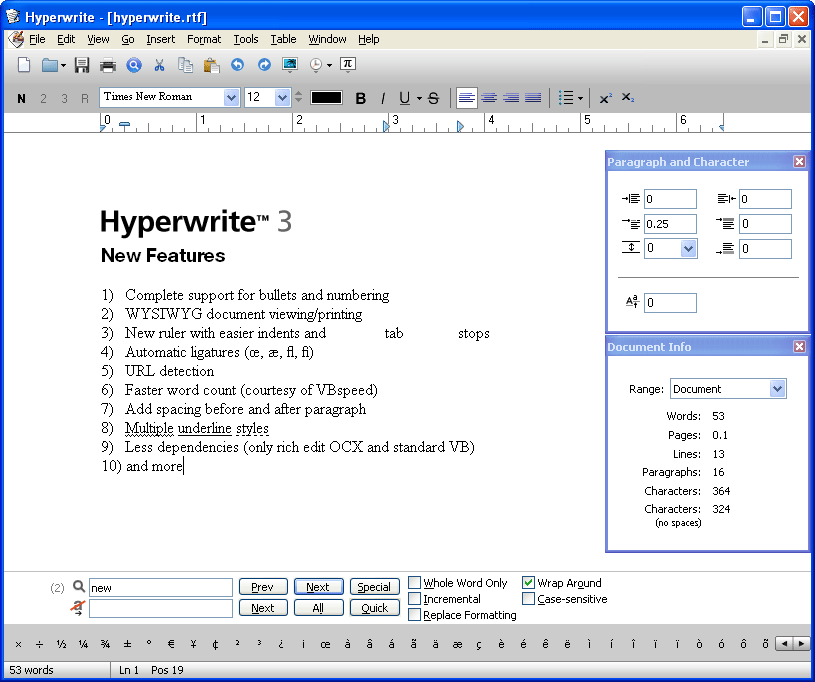



## Hyperwrite \(version 3\)

### Description

An RTF word processor with Auto-Correction, tables, quick font switching, highlighting, advanced paragraph features, and more.
 
### More Info
 

             |
---                |---
**Submitted On**   |2008-07-21 12:25:06
**By**             |[NIXON Software](https://github.com/Planet-Source-Code/PSCIndex/blob/master/ByAuthor/nixon-software.md)
**Level**          |Intermediate
**User Rating**    |5.0 (95 globes from 19 users)
**Compatibility**  |VB 6\.0
**Category**       |[Complete Applications](https://github.com/Planet-Source-Code/PSCIndex/blob/master/ByCategory/complete-applications__1-27.md)
**World**          |[Visual Basic](https://github.com/Planet-Source-Code/PSCIndex/blob/master/ByWorld/visual-basic.md)
**Archive File**   |[Hyperwrite2121297212008\.zip](https://github.com/Planet-Source-Code/nixon-software-hyperwrite-version-3__1-66376/archive/master.zip)

